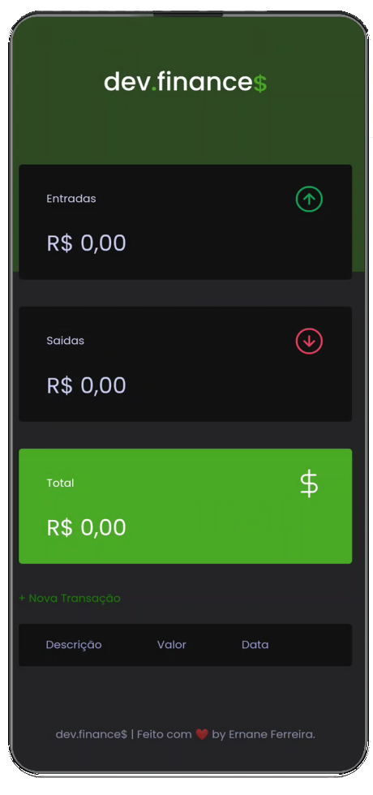
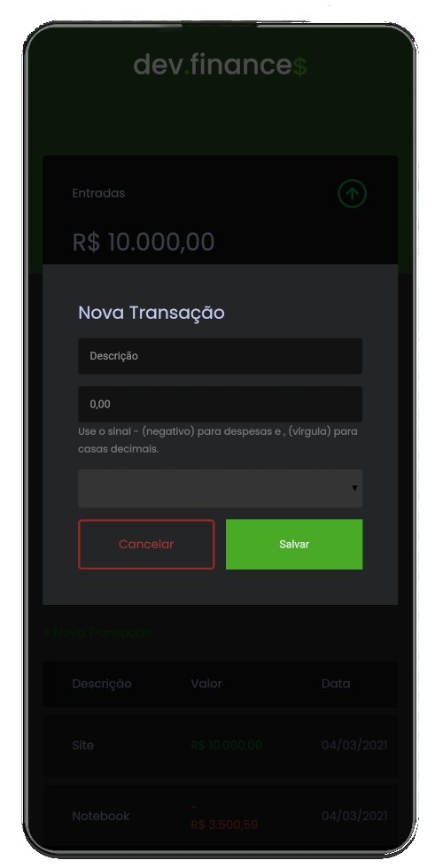

<h1 align="center">
  
</h1>

<p align="center">
  <a href="#-tecnologias">Tecnologias</a>&nbsp;&nbsp;&nbsp;|&nbsp;&nbsp;&nbsp;
  <a href="#-projeto">Projeto</a>&nbsp;&nbsp;&nbsp;|&nbsp;&nbsp;&nbsp;
  <a href="#-processos">Processos</a>&nbsp;&nbsp;&nbsp;
</p>

<br>

<p align="center">
  
  
</p>

## 🚀 Tecnologias

Esse projeto foi desenvolvido com as seguintes tecnologias:

Para o desenvolvimento mobile:
- Java

Para a criação do site:
- HTML
- CSS
- JavaScript

## 💻📲 Projeto

O <a href="https://github.com/ErnaneJ/dev.finance">dev.finance$</a> é uma aplicação de controle financeiro, onde é possível cadastrar e excluir transações além de ver em tempo de execução o saldo de entrada e saída sendo atualizado. Com o intuito de facilitar o acesso e dar mais praticidade diária a utilização do app web foi criada uma versão sua para dispositivos android da maneira mais simples e prática utilizando a linguagem java. 💰

Clique <a href="apk/dev.Finance$.apk" download>aqui</a> para baixar o apk.

## 📲 Processos
Nesta seção irei mostrar os passos para transformar o seu site em um app android de uma forma simples e rápida. Para isso será necessário o Android Studio e nele utilizaremos a linguagem Java.<br/>
O jeito mais simples e rápido de transformar uma página em um aplicativo para dispositivos android é incorporar o site dentro de um componente android chamado WebView. Para fazer isso precisamos realizar algumas ações que estará o passo a passo aqui abaixo.<br>
<span style="color='red'">Vale ressaltar que este método não substitui o desenvolvimento nativo android e ele contém certas limitações<span>.<br>


- <strong>Crie um novo projeto:</strong><br>
Abra o android Studio e crie um novo projeto com uma Empty activity, nele coloque o nome desejado, selecione a SDK minima <em>- utilizei API 18: Android 4.3 (Jelly Bean) -</em> e escolha a linguagem JAVA. Prossiga e espere os arquivos iniciais carregarem.

- <strong>Layout</strong><br>
Abra o arquivo de layout que se encontra em res > layout > activity_main.xml. Com o arquivo aberto vá em "split" no canto superior direito para poder ter uma melhor visualização. 

- <strong>activity_main.xml </strong><br>
Precisaremos fazer as seguintes alterações: como não teremos componentes nativos iremos alterar a tag principal por outra chamada FrameLayout pois so precisaremos renderizar na tela a webView. Por padrão a activity main vem com uma TextView "hello World" iremos apaga-la e criar no lugar uma webView.<br> Nesta webview criaremos um id para podermos ter essa referência na unidade lógica do JAVA e podermos acessá-la (utilizei como id o nome "webview" mesmo), além disso colocaremos sua altura e largura como match_parent para que ela se adapte a largura e altura do dispositivo acessado.

- <strong>AndroidManifest.xml</strong><br>
Após os passos acima concluidos deveremos permitir o nosso aplicativo a acessas a internet. Para isso, acessaremos o arquivo AndroidManifest.xml que se envontra no diretório do aplicativo dentro da pasta manifest. Lá adicionaremos a seguinte linha de código:<br><br>
```xml 
<uses-permission android:name="android.permission.INTERNET"/>
```
<br><br>
- <strong>MainActivity</strong><br>
Agora sim temos o que precisamos. Após todos os passos acima, iremos acessar a nossa MainActivity e com a referencia da main activity que criamos colocar o site para abrir no app.<br>
primeiramente iremos buscar a referencia da nossa webView para isso criamos um objeto Webview e referenciamos pelo Id a que criamos nele:<br><br>
``` WebView webView = findViewById(R.id.webView);```
<br><br>Depois disso pegaremos nossa webView e utilizaremos uma função chamada loadUrl() que receberá como parametro uma string e essa estring é justamente o site que queremos:<br><br>
```webView.loadUrl("https://www.sitedeexemplo.com.br")```
<br><br>Somente com isso nós já teremos o nosso site rodando na webview pois ela interpreta HTML e CSS porém precisamos dar premissão para que ela execute códigos javascript também e sem isso provavelmente algumas funcionalidades do site ficarão inutilizaveis. Para fazer essa configuração adicionaremos a seguinte linha de código:<br><br>
```webView.getSettings().setJavaScriptEnabled(true)```
<br><br>Não foi o caso do dev.finances mas possivelmente o seu site terá links que redicrecione ele para alguma parte ou página do próprio site e o aplicativo executará essa ação no navegador padrão. para fazermos com que essas páginas executem dentro do app podemos barrar essa execução e fazer ela rodar na propria webView da seguinte maneira:<br><br>
```web.View.setWebViewClient(new WebViewClient());```
<br><br>

Após esses passos o seu site irá rodar dentro dessa webView e estará funcionando como um app mobile. Existem outrsas configurações pertinentes porém isso varia do gosto e das funcionalidades que o seu site tiver. Por exemplo, o dev.finances utiliza localStorage e isso é outra configuração necessária a adicionar na webview:<br><br>
```java
settings.setDomStorageEnabled(true);
```
<br>
 Outra alteração pertinente é na barra superior. Como este app não precisa de "action bar" então se torna necessária a remoção dela. Acessando os estilos (value>styles.xml) da aplicação podemos alterar a propriedade "parent" que se refere ao tema da action Bar e ao mudarmos para ".noActionBar" ela sairá do nosso layout. Neste mesmo local você pode verificar e alterar as cores primárias para que fiquem de acordo com o site.
<br><br>

Essa personalização varia do estilo de cada site e depende apenas da criatividade! Espero ter ajudado. 😉

---
<p align="center">
Feito com ♥ by Ernane Ferreira 👋🏻<br/>
</p>

